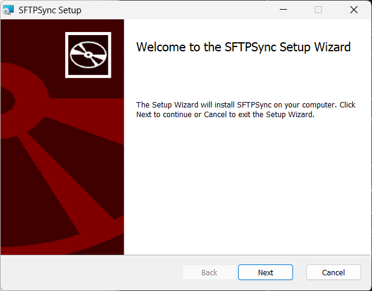
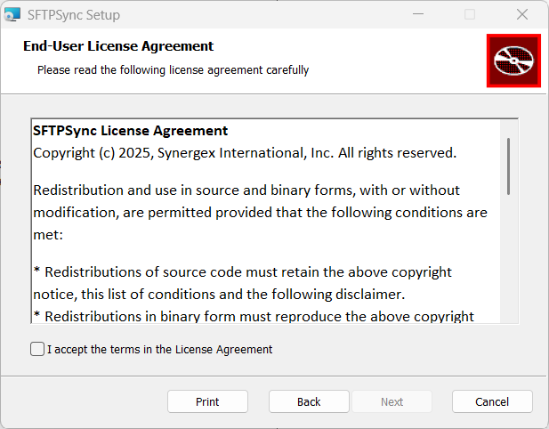
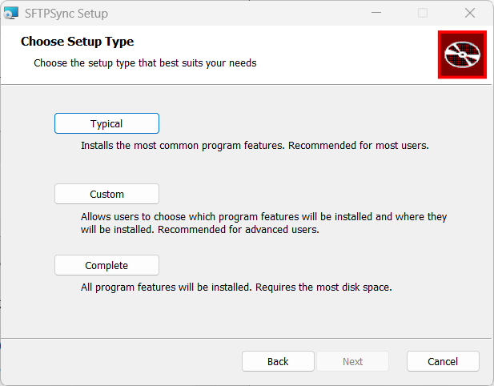
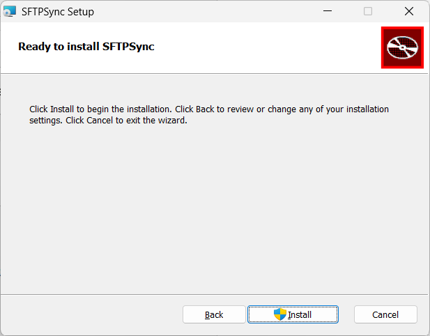
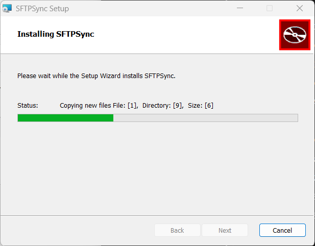
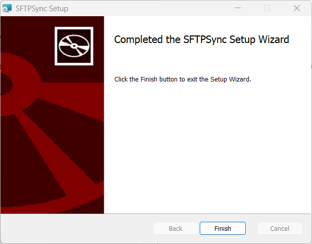
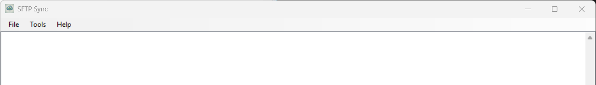
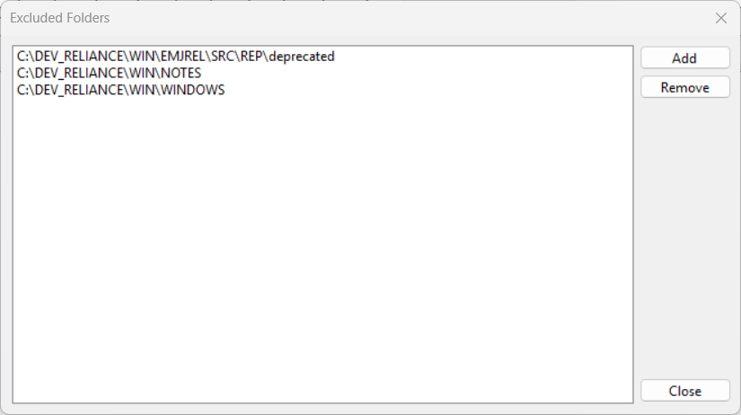

[](https://github.com/Synergex/RemoteSFTPSync/actions/workflows/build.yml)

# SFTP Sync

SFTP Sync is a utility application that can synchronize a local directory
structure and files to a remote system via the Secure FTP protocol.

When first activated the product will first check whether the local and
remote directories are synchronized, and if not will update the remote
directories and files to match the local directories and files.

Once synchronized the application then monitors the local directories for
changes in real time, and replicates those changes in the remote system.

Two versions of the application are available, one with a Windows user
interface, and one used from the Windows command line.

* [Important Usage Informnation](#important-usage-information)
* [Downloading and Installing](#downloading-and-installing)
* [Windows Desktop Application](#windows-desktop-application)
* [Windows Command-Line Application](#windows-command-line-application)
* [Uninstalling](#uninstalling)

---

## Important Usage Information

Regardless of whether you use the command-line or Windows desktop
application, it is important that you understand how the product works, 
so please read the information below carefully.

When you first start the command-line product, or enable sync in the 
Windows desktop tool, a worker thread is created to take care of syncing 
each of the file spec patterns that you have specified. So if you have 
specified four file extensions, like this:

```
*.DBL;*.DEF;*.COM;*.SCM
```

Then four worker threads will be started, one for each file extension pattern.

Before any files can be synced the entire directory tree must be present
on the remote system, and ensuring that this is the case is a task 
assigned to the first worker thread to be created. Once that task has 
been completed, that thread can then begin the task of checking whether 
the files on the remote system currently match the files on the local 
system, and uploading any missing files for that file extension.

As soon as the first worker thread has completed it's additional task 
of checking the directory structure, any other worker threads will be 
created and will go to work performing the initial synch for based on 
their assigned file extension pattern.

As soon as each worker thread has completed its initial sync, it then 
starts monitoring the file system for changes to files matching the 
assigned file extension pattern. and replicating those changes to the 
remote system.

Regardless of which application you use, you will see a message 
"Initial sync complete, real-time sync now active" when this happens, 
and in the Windows desktop application you will also see "Real time 
sync active" in the status bar at the bottom of the application. 
Ideally you should not make changes to files in the replicated 
directory tree until you see these messages.

---

## Downloading and Installing

If you prefer you can clone the Git repository and build your own 
version, but if you want an easy life then the best option is to 
download the MSI installer for the latest version from 
https://github.com/Synergex/RemoteSFTPSync/releases and install it 
on your system.

When you start the installation this is what you will see:



Click the Next button to continue, and you will see this:



Click the check-box to accept the open-source license agreement, 
then click the Next button. You will see this:



Most users should click the Complete button, but if you prefer not 
to install the command-line program or the documentation, then you 
can click the Custom button and de-select those options. After 
clicking the Complete button you will see this:



Click the Install button to begin the installation. Having done so
you will see a User Account Control (UAC) prompt, and you should click
on the Yes button to confirm that you wish to install the product. You 
will then see a progress dialog as the installation proceeds:



And when the installation completes you will see this:



Click the Finish button to complete the installation.

---

## Windows Desktop Application

The Windows UI application is provided via a program called 
SFTPSyncUI.exe which you can open via a Start Menu icon. When 
you start the application for the first time you sill see this:



You must provide information about the local root directory that 
contains the files that you want to replicate, as well as a search 
spec that defines the file extensions of the files to be copied. 
You must also provide information about the OpenVMS system that you 
want to replicate the files to, the user account name and password 
to authenticate with, and the remote path to replicate the directories 
and files to.

Refer to the following information:

### Local path

The local path identifies the local root directory to be replicated. 
All files in and below this directory that match the search spec 
(below) will be replicated to the remote OpenVMS system. You can 
use the ellipsis button (...) adjacent to the field to show a 
directory browser dialog to make it easy to pick a local directory. 
The value of the field should look like this:

```
C:\MYDEVFILES\MYPROJECT
```

### Search spec

The search spec is a semi-colon delimited list of file patterns to 
be matched and replicated. For example if you want to replicate all 
files with DBL, DEF and INC file extensions to the remote system then 
your search spec would look like this:

```
*.DBL;*.DEF;*.INC
```

### Remote path

The remote path field is used to specify a path on the remote 
OpenVMS system that represents the root directory for the 
replicated files. The path must be expressed in Unix format, 
and to some extent depends on the configuration of your system. 
In many cases an OpenVMS path like DKA0:[MYUSER.DEVFILES.MYPROJECT] 
will be specified like this:

```
/DISK$DKA0/MYUSER/DEVFILES/MYPROJECT/
```

But your system may require something different. To determine the 
value of the remote path we recommend using an application such as 
WinSCP or FileZilla to make an SFTP connection to the system and 
user account, and then determine the path based on what you see in 
that application.

### Remote host

In this field you should enter the DNS name or TCP/IP address of 
the remote OpenVMS system to be accessed. For example:

```
VMSDEV1.MYDOMAIN.COM
```
or
```
10.1.1.15
```

### Remote user

In this field you should enter the user name of the OpenVMS user 
account to be used to log in to the remote system. Note that OpenVMS 
usernames are not usually case sensitive, but in some cases can be.

### Remote Password

In this field you should enter the password associated with the 
OpenVMS user account to be used to log in to the remote system. 
Note that OpenVMS passwords are not usually case sensitive, but 
in some cases can be.

### Start at login

If the Start at login option is checked then each time you log in 
to your Windows user account, the SFTPSync desktop application will 
be started.

### Start in system tray

If the Start in system tray option is checked then each time the 
SFTPSync desktop application starts it will start in the Windows 
System Tray. If not checked you will see the main window appear 
on your desktop.

### Auto start sync

If the Auto start sync option is checked then each time the 
SFTPSync desktop application starts it will automatically begin 
synchronizing directories and files with the remote OpenVMS system, 
so long as all of the configuration options are specified and correct. 
If settings are missing, or remote information has not been validated, 
then synchronization will not begin automatically.

### Exclusions

Clicking the exclusions button will show the Excluded Directories
dialog, which you can use to exclude directories and directory trees
from the sync process, regardless of whether those directories contain
any files that match the Search Spec file extensions.



### Show Password

The value entered into the password field is normally hidden, but 
can be revealed by checking the Show password option.

As with the other configuration details, the password is stored in 
the applications configuration file, but in an encrypted form. The 
encryption used keys provided by the Windows operating system that 
are associated with the current Windows user account, and so can 
only be decrypted when logged into the same account.

### Verify Access

The Verify Access button will be enabled whenever the remote 
credentials (host name, user name or password) change. When 
enabled, clicking the button will initiate an SFTP connection 
using the currently defined information, and you will see a message 
indicating whether the connection was successful. Until a successful 
connection is made, is is not possible to initiate directory and file 
synchronization.

### Start Sync

Having successfully verified remote access you have the option to 
click the Start Sync button, which as its name suggests, starts the 
process of synchronizing directories and files from the Windows 
system to the remote OpenVMS system. Note that synchronization 
occurs in one direction only; changes to directories and files 
on the Windows system are re-created on the OpenVMS system, but 
changes on the OpenVMS system are NOT re-created on Windows.

### Viewing the Application Window

If configured, the application will start as a small icon in the 
Windows System Tray. In this case you can right-click on the icon 
and use the resulting context menu to show the main user interface, 
display the documentation, or exit the application.

### Exiting the Application

Regardless of configuration options there are only three ways to exit 
from the application:

1. Right-click the icon in the System Tray and select Exit.
2. Log out of your Windows user account.
3. Close down the system.

### Running Multiple Instances

This application does not support running multiple instances. If 
you attempt to start a second instance, the user interface of the 
riginal running instance will be shown.

### The Message Log

The message log occupies most of the area of the user interface, and 
you will see status messages being displayed as the application 
replicates local file system changes to the remote system.

---

## Windows Command-Line Application

The Windows command-line application is provided via a program called 
SFTPSync.exe. 

The application accepts configuration information via command line 
arguments.

If you execute the application with no command line arguments, usage 
information will be displayed, like this:

```
C:\Program Files\Synergex\SFTPSync> SftpSync
```
usage: SFTPSync host username password localRootDir remoteRootDir 
searchPattern

 ### Command Line Parameters

The command line parameters correspond to the various options in the
Windows desktop application, and are as follows:

#### host

Specify the DNS name or TCP/IP address of the remote OpenVMS system to 
be accessed. For example:

```
VMSDEV1.MYDOMAIN.COM
```
or
```
10.1.1.15
```

#### username

Specify the user name of the OpenVMS user account to be used to log 
in to the remote system. Note that OpenVMS user account names are not 
usually case sensitive, but in some cases can be.

#### password

Specify the password associated with the OpenVMS user account to be 
used to log in to the remote system. Note that OpenVMS passwords are 
not usually case sensitive, but in some cases can be.

The value entered into the password field is normally hidden, but can 
be revealed by checking the Show password option.

As with the other configuration details, the password is stored in 
the applications configuration file, but in an encrypted form. The 
encryption used keys provided by the Windows operating system that 
are associated with the current Windows user account, and so can only 
be decrypted when logged into the same account.

#### localRootDir

Specify the local root directory to be replicated. All files in and 
below this directory that match the search spec (below) will be 
replicated to the remote OpenVMS system. You can use the ellipsis 
button (...) adjacent to the field to show a directory browser dialog 
to make it easy to pick a local directory. The value of the field 
should look like this:

```
C:\MYDEVFILES\MYPROJECT
```
If the path includes spaces then enclose the value in double quotation 
marks.

#### remoteRootDir

Specify a path on the remote OpenVMS system that represents the root 
directory for the replicated files. The path must be expressed in Unix 
format, and to some extent depends on the configuration of your system. 
In many cases an OpenVMS path like DKA0:[MYUSER.DEVFILES.MYPROJECT] 
will be specified like this:
```
/DISK$DKA0/MYUSER/DEVFILES/MYPROJECT/
```
But your system may require something different. To determine the value 
of the remote path we recommend using an application such as WinSCP or 
FileZilla to make an SFTP connection to the system and user account, 
and then determine the path based on what you see in that application.

#### searchPattern

Specify a semi-colon delimited list of file patterns to be matched and 
replicated. For example if you want to replicate all files with DBL, DEF 
and INC file extensions to the remote system then your search spec would 
look like this:
```
*.DBL;*.DEF;*.INC
```

### Example Command

Here is an example command:
```
C:\> "C:\Program Files\Synergex\SFTPSync.exe" VMSDEV1.MYDOMAIN.COM MYUSER MYPASSWORD "C:\MY DEV FILES\MY PROJECT" /DISK$DKA0/MYUSER/DEVFILES/MYPROJECT/ *.DBL;*.DEF;*.INC
```

---

## Uninstalling

To remove SFTPSync from your system, then first ensure that you have 
closed the application, then use the Windows control panel to remove 
the application.
